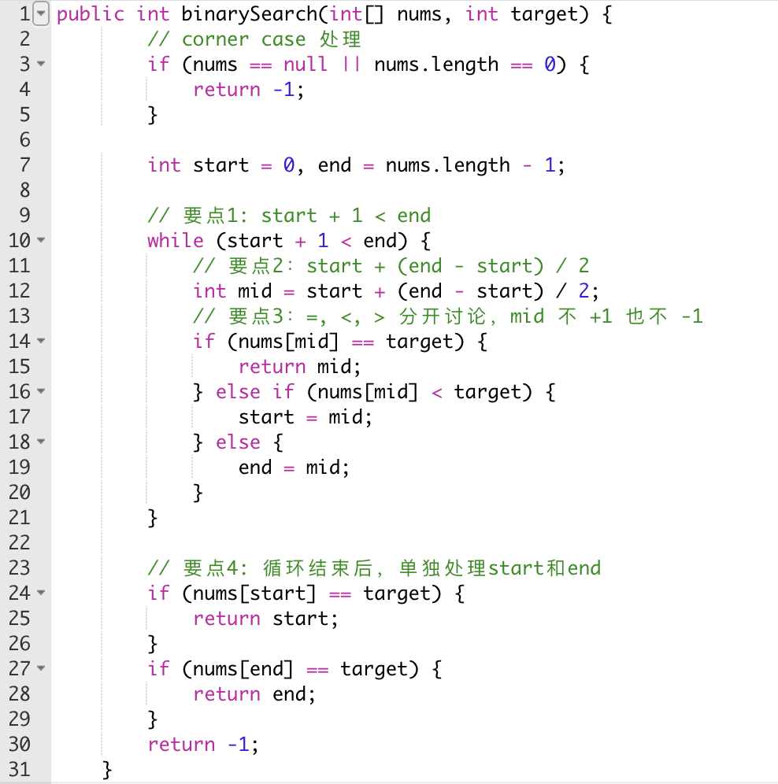

# Leetcode-3000
### Binary Search
* 使⽤条件
 1. 排序数组 (30-40%是⼆分)
 2. 当⾯试官要求你找⼀个⽐ O(n) 更⼩的时间复杂度算法的时候(99%)
 3. 找到数组中的⼀个分割位置，使得左半部分满⾜某个条件，右半部分不满⾜(100%)
 4. 找到⼀个最⼤/最⼩的值使得某个条件被满⾜(90%)
* 复杂度
 1. 时间复杂度：O(logn)
 2. 空间复杂度：O(1)
* 代码模版
 *  